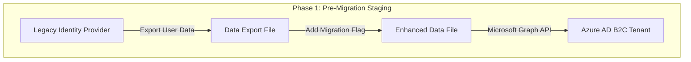
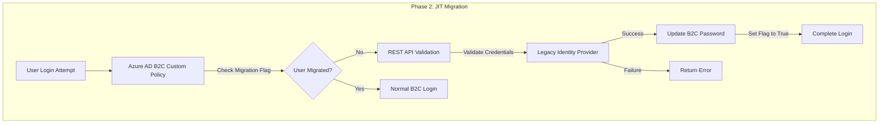
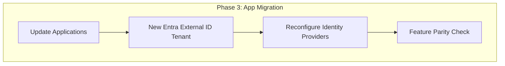
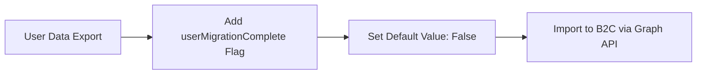
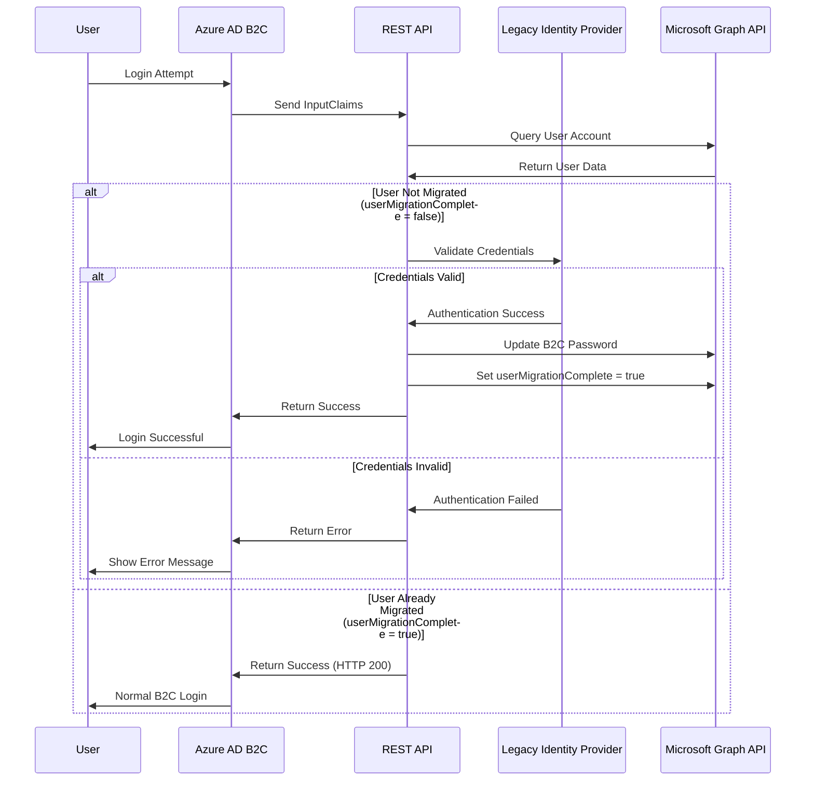
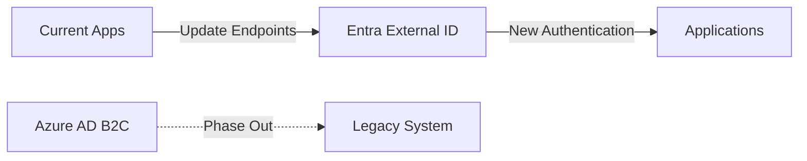

# Complete Guide: Migrating from Azure AD B2C to Entra External ID

## Introduction

This comprehensive tutorial covers the complete migration process from Azure AD B2C to Entra External ID, focusing on the **Just-in-Time (JIT) migration approach** which allows for seamless user migration without forcing password resets or service interruptions.

## Understanding the Migration Challenge

You **cannot simply "sync"** data from an existing Azure AD B2C tenant to a new Entra External ID tenant. The migration requires a deliberate and well-planned strategy because:

- Azure AD B2C and Entra External ID are separate services built on different platforms
- They have different APIs and data models
- Password hashes are not compatible between systems
- A manual export and import process is required

## When to Use Just-in-Time Migration

The JIT migration approach is ideal when:

- Plaintext passwords in the old identity provider are not accessible
- Passwords are stored in one-way encrypted format (hash functions)
- The legacy identity provider stores passwords in an inaccessible way
- You want to avoid disrupting users' experience
- You cannot afford system downtime

## Migration Architecture Overview

## Step-by-Step Migration Process

### Phase 1: Pre-Migration Staging

#### Step 1: Create New Entra External ID Tenant

1. Provision a new, dedicated Entra External ID tenant
2. This tenant will be completely separate from your existing B2C tenant

#### Step 2: Export User Data from B2C

1. Use Microsoft Graph API to export all user data from Azure AD B2C:
   - Email addresses
   - Names
   - Custom attributes
   - All available clear-text data

2. Create a data export file (Excel, CSV, or similar format)

3. For inaccessible data (like encrypted passwords), populate with placeholder values:
   - Example: "ToBeUpdated"

#### Step 3: Add Migration Tracking Attribute

1. Navigate to "User Attributes" in your B2C tenant
2. Create a custom boolean attribute named `userMigrationComplete`
3. Add this as a column to your data export file
4. Default all values to `False`

#### Step 4: Import Staged Data

Use Microsoft Graph API to import the enhanced user data into Azure AD B2C.

### Phase 2: Seamless Migration During Authentication

#### Step 5: Create Custom Policy

Develop a custom policy in Azure AD B2C that triggers a REST API during the sign-in process.

#### Step 6: Implement REST API

Create a REST API endpoint that handles the migration logic:

#### REST API Logic Flow

1. **Parse Input**: Extract user credentials from InputClaims
2. **Query B2C User**: Use Microsoft Graph API to find the user account
3. **Check Migration Status**: Evaluate the `userMigrationComplete` attribute
4. **Validate Against Legacy**: If not migrated, proxy authentication to legacy system
5. **Update B2C**: On successful validation, set password and update migration flag
6. **Handle Errors**: Return appropriate error messages for failed authentications

### Phase 3: Complete Migration to Entra External ID

#### Step 7: Create Entra External ID Tenant

Set up your new Entra External ID tenant that will replace B2C.

#### Step 8: Export and Import User Data

1. **Export from B2C**: Use Microsoft Graph API to export all user data
2. **Handle Passwords**: Implement the same JIT approach for Entra External ID
3. **Import to Entra External ID**: Use Microsoft Graph API to create user accounts

#### Step 9: Reconfigure Applications

Update your applications to point to the new Entra External ID tenant's authentication endpoints.

#### Step 10: Re-establish Identity Providers

Reconfigure social and enterprise identity providers (Google, Facebook, Azure AD, etc.) in your new Entra External ID tenant.

#### Step 11: Address Feature Parity

1. Audit your current B2C tenant for custom features
2. Ensure equivalent functionality exists in Entra External ID
3. Migrate or recreate custom XML policies as needed

## Migration Considerations

### Password Migration Challenges

- **Hash Incompatibility**: B2C password hashes cannot be directly imported
- **JIT Solution**: Passwords are migrated on first successful login
- **Fallback Strategy**: Users who don't log in within a set timeframe will need password reset

### Minimizing Downtime

1. **Staged Approach**: Pre-migrate user data while old system remains active
2. **Gradual Cutover**: Switch applications one at a time
3. **Rollback Plan**: Keep legacy system available during transition period

### User Experience

- **Transparent Migration**: Users don't need to reset passwords
- **Single Login**: Password migration happens automatically on first login
- **Error Handling**: Clear error messages for authentication failures

## Best Practices

1. **Test Thoroughly**: Validate the migration process with a subset of users
2. **Monitor Performance**: Track API response times and success rates
3. **Communication**: Inform users about the migration timeline
4. **Backup Strategy**: Maintain backups of all user data
5. **Gradual Rollout**: Phase the migration across user groups

## Troubleshooting Common Issues

### API Authentication Failures
- Verify legacy system connectivity
- Check credential mapping between systems
- Validate Graph API permissions

### Migration Flag Issues
- Ensure custom attribute is properly created
- Verify data import included the migration flag
- Check Graph API queries for the attribute

### Application Integration Problems
- Update all authentication endpoints
- Verify redirect URIs are configured
- Test all identity provider integrations

## Conclusion

The Just-in-Time migration approach provides a seamless way to migrate users from Azure AD B2C to Entra External ID without disrupting the user experience. While complex, this method ensures:

- **Zero Password Reset Requirements**: Users maintain their existing passwords
- **Minimal Downtime**: Migration happens transparently during normal login
- **Flexible Timeline**: Users migrate naturally as they log in
- **Fallback Options**: Self-service password reset for inactive users

By following this comprehensive guide and implementing the JIT migration pattern, organizations can successfully transition to Entra External ID while maintaining a smooth user experience throughout the migration process.