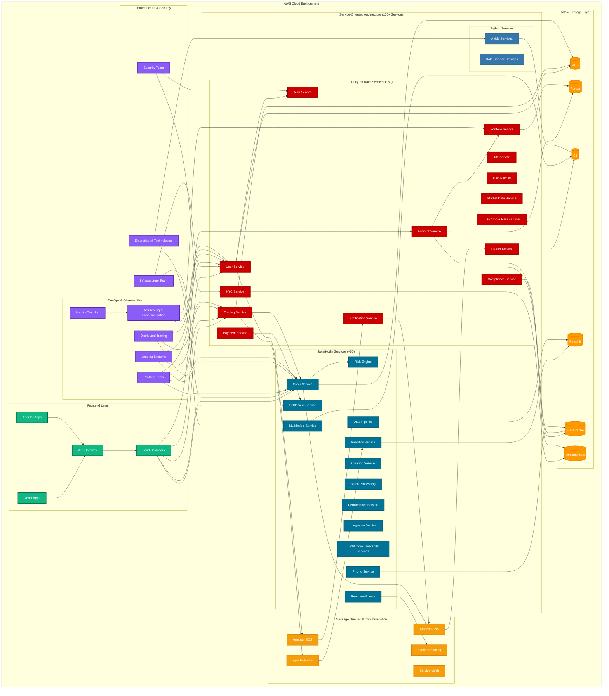

```mermaid
graph TB
    subgraph "AWS Cloud Environment"
        subgraph "Frontend Layer"
            React[React Apps]
            Angular[Angular Apps]
            API[API Gateway]
            LB[Load Balancers]
        end
        
        subgraph "Service-Oriented Architecture (100+ Services)"
            subgraph "Ruby on Rails Services (~50)"
                UserSvc[User Service]
                AccountSvc[Account Service]
                TradingSvc[Trading Service]
                AuthSvc[Auth Service]
                PortfolioSvc[Portfolio Service]
                PaymentSvc[Payment Service]
                ReportSvc[Report Service]
                TaxSvc[Tax Service]
                NotifSvc[Notification Service]
                KYCSvc[KYC Service]
                RiskSvc[Risk Service]
                MarketSvc[Market Data Service]
                ComplianceSvc[Compliance Service]
                RailsEtc[... +37 more Rails services]
            end
            
            subgraph "Java/Kotlin Services (~50)"
                OrderSvc[Order Service]
                SettlementSvc[Settlement Service]
                AnalyticsSvc[Analytics Service]
                ClearingSvc[Clearing Service]
                RiskEngine[Risk Engine]
                PricingSvc[Pricing Service]
                MLSvc[ML Models Service]
                DataPipeline[Data Pipeline]
                BatchSvc[Batch Processing]
                EventSvc[Real-time Events]
                PerfSvc[Performance Service]
                IntegrationSvc[Integration Service]
                JavaEtc[... +38 more Java/Kotlin services]
            end
            
            subgraph "Python Services"
                AISvc[AI/ML Services]
                DataSciSvc[Data Science Services]
            end
        end
        
        subgraph "Message Queues & Communication"
            SQS[Amazon SQS]
            SNS[Amazon SNS]
            Kafka[Apache Kafka]
            EventStream[Event Streaming]
            ServiceMesh[Service Mesh]
        end
        
        subgraph "Data & Storage Layer"
            RDS[(RDS)]
            Aurora[(Aurora)]
            S3[(S3)]
            ElastiCache[(ElastiCache)]
            DocumentDB[(DocumentDB)]
            Redshift[(Redshift)]
        end
        
        subgraph "Infrastructure & Security"
            InfraSec[Infrastructure Team]
            Security[Security Team]
            EnterpriseAI[Enterprise AI Technologies]
        end
        
        subgraph "DevOps & Observability"
            Profiling[Profiling Tools]
            Logging[Logging Systems]
            Tracing[Distributed Tracing]
            Tracking[Metrics Tracking]
            ABTesting[A/B Testing & Experimentation]
        end
    end
    
    %% Frontend to Services
    React --> API
    Angular --> API
    API --> LB
    LB --> UserSvc
    LB --> AccountSvc
    LB --> TradingSvc
    LB --> OrderSvc
    LB --> SettlementSvc
    
    %% Service to Service Communication
    UserSvc --> AuthSvc
    AccountSvc --> PortfolioSvc
    TradingSvc --> OrderSvc
    OrderSvc --> RiskEngine
    PaymentSvc --> SettlementSvc
    
    %% Services to Message Queues
    UserSvc --> SQS
    TradingSvc --> Kafka
    OrderSvc --> SNS
    NotifSvc --> SNS
    EventSvc --> EventStream
    
    %% Message Queues to Services
    SQS --> NotifSvc
    Kafka --> AnalyticsSvc
    SNS --> ReportSvc
    
    %% Services to Data Layer
    UserSvc --> RDS
    AccountSvc --> Aurora
    PortfolioSvc --> Aurora
    TradingSvc --> RDS
    OrderSvc --> RDS
    ReportSvc --> S3
    AnalyticsSvc --> Redshift
    MLSvc --> S3
    DataPipeline --> Redshift
    AISvc --> S3
    
    %% Caching
    UserSvc --> ElastiCache
    AccountSvc --> ElastiCache
    PricingSvc --> ElastiCache
    
    %% Document Storage
    KYCSvc --> DocumentDB
    ComplianceSvc --> DocumentDB
    
    %% Infrastructure Dependencies
    InfraSec --> UserSvc
    InfraSec --> OrderSvc
    Security --> AuthSvc
    Security --> KYCSvc
    EnterpriseAI --> AISvc
    EnterpriseAI --> MLSvc
    
    %% Observability
    Profiling --> UserSvc
    Profiling --> TradingSvc
    Profiling --> OrderSvc
    Logging --> UserSvc
    Logging --> TradingSvc
    Logging --> OrderSvc
    Tracing --> UserSvc
    Tracing --> TradingSvc
    Tracing --> OrderSvc
    Tracking --> ABTesting
    ABTesting --> UserSvc
    ABTesting --> PortfolioSvc
    
    %% Styling
    classDef rubyService fill:#CC0000,stroke:#990000,stroke-width:2px,color:#fff
    classDef javaService fill:#007396,stroke:#005A7A,stroke-width:2px,color:#fff
    classDef pythonService fill:#3776AB,stroke:#2E5B8A,stroke-width:2px,color:#fff
    classDef frontend fill:#10B981,stroke:#065F46,stroke-width:2px,color:#fff
    classDef aws fill:#FF9900,stroke:#E68200,stroke-width:2px,color:#fff
    classDef data fill:#1F2937,stroke:#374151,stroke-width:2px,color:#fff
    classDef infra fill:#8B5CF6,stroke:#5B21B6,stroke-width:2px,color:#fff
    classDef messaging fill:#F59E0B,stroke:#D97706,stroke-width:2px,color:#fff
    
    class UserSvc,AccountSvc,TradingSvc,AuthSvc,PortfolioSvc,PaymentSvc,ReportSvc,TaxSvc,NotifSvc,KYCSvc,RiskSvc,MarketSvc,ComplianceSvc,RailsEtc rubyService
    class OrderSvc,SettlementSvc,AnalyticsSvc,ClearingSvc,RiskEngine,PricingSvc,MLSvc,DataPipeline,BatchSvc,EventSvc,PerfSvc,IntegrationSvc,JavaEtc javaService
    class AISvc,DataSciSvc pythonService
    class React,Angular,API,LB frontend
    class RDS,Aurora,S3,ElastiCache,DocumentDB,Redshift aws
    class SQS,SNS,Kafka,EventStream,ServiceMesh messaging
    class InfraSec,Security,EnterpriseAI,Profiling,Logging,Tracing,Tracking,ABTesting infra
```